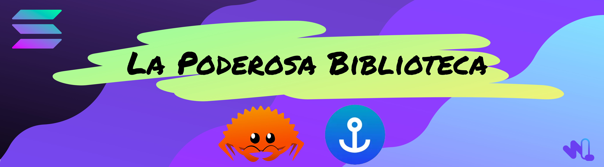
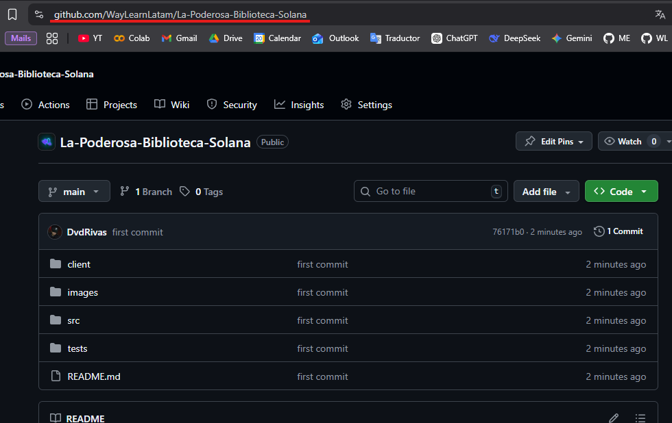
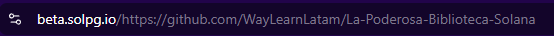
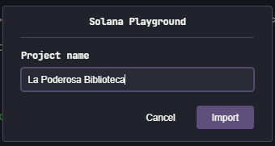

# La Poderosa Biblioteca en Solana



CRUD básico de un Solana Program desarrollado con Rust y Anchor desde el Solana Playground. 

Puedes comenzar dándole Fork a este repositorio (abajo te explicamos como 👇), **hemos preparado un entorno de codespaces listo para que no tengas que instalar nada**, solo déjate llevar por la fluidez de los ejercicios y temas desarrollados especialmente para ti. 

Asegúrate de clonar este repositorio a tu cuenta usando el botón **`Fork`**.


## Importando el proyecto 

Ya con el repositorio en tu cuenta lo siguiente que debes hacer copiar el `enlace de tu repositorio`, lo que se puede hacer directamente desdel navegador:


Posteriormente, lo uniremos con el siguiente enlace en nuestro navegador de preferencia:

```url
https://beta.solpg.io/
```

Lo que nos dará algo parecido a:



Al pulsar enter seremos enviados al `Solana Playground` con nuestro proyecto abierto:


Para guardarlo solo damos clic en el boton `import` y asignamos un nombre:



## Preparacion del entorno

Primero conectaremos el entorno con la devnet, lo que tambien procederá a la creación de una wallet. Para eso daremos clic en donde dice **Not Conected**:


Saldrá la siguiente ventana donde daremos en el botón **Continue**:


Como resultado se mostrará la siguiente información:


* En verde: el estado de la conexión y el entorno al que se encuentra conectado

* En amarillo: la la dirección de la wallet conectada

* En azul: la cantidad de tokens en la wallet

> ℹ️ ¿Quieres ver el ejemplo de un "Hola Mundo" en Solana?. Da clic aquí: 👉 [Ver Ejemplo](https://github.com/WayLearnLatam/Solana-starter-kit/tree/1fc6349ba63375a3fe223d8d56911bc64765459b/build-deploy)

> ℹ️ ¿Cuentas con una Wallet de [Phantom](https://phantom.com/) que deseas importar?, Da clic aquí para ver como hacerlo: 

👉 [Como Importar una Wallet](https://github.com/WayLearnLatam/Solana-starter-kit/tree/1fc6349ba63375a3fe223d8d56911bc64765459b/import-key-a-playground)